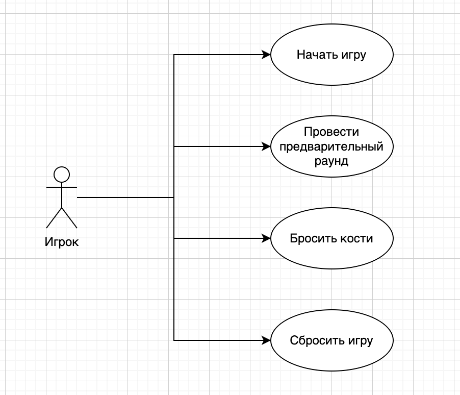

# Лабораторая работа №1
**Проект: 15. Игра в кости «Тузы»**

Диаграмма вариантов использования (use-case)

---
## Прецедент "Запуск игры"
**Описание**: Игрок начинает новую игру, указывая свое имя и количество ботов.
- **Основной исполнитель**: Игрок
- **Предусловие**: Приложение готово к запуску
- **Постусловие**: Начало предворительного раунда

### Основной успешный сценарий:
| Пользователь                                              | Система                                    | 
|-----------------------------------------------------------|--------------------------------------------|
| 1. Игрок запускает приложение.                            |                                            | 
| 2. Игрок вводит свое имя и количество ботов (от 1 до 10). | 	                                          |	
|                                                           | 3. Создается игра с указанными параметрами |
|                                                           | 	4. Начинается предварительный раунд.      |

### Альтернативный сценарий "Некорректные параметры":
| Пользователь                                                                                        | Система                                                         | 
|-----------------------------------------------------------------------------------------------------|-----------------------------------------------------------------|
| 1. Игрок запускает приложение.                                                                      |                                                                 | 
| 2. Игрок не вводит свое имя или вводит некорректное количество ботов (меньше одного или больше 10). | 	                                                               |	
|                                                                                                     | 3. Отображает сообщение об ошибке и предлагает ввести параметры |

---
## Прецедент "Провести предворительный раунд"
**Описание**: Каждый игрок бросает кости для определения порядка хода.
- **Основной исполнитель**: Игрок
- **Предусловие**: Игра запущена с указанными параметрами (имя игрока и количество ботов)
- **Постусловие**: Установлен игрок, который будет ходить первым в основной игре

### Основной успешный сценарий:
| Пользователь            | Система                                                                                                                      | 
|-------------------------|------------------------------------------------------------------------------------------------------------------------------|
| 1. Игрок бросает кости. |                                                                                                                              | 
|                         | 2. Система сохраняет результат броска	                                                                                       |	
|                         | 3. После бросков всех пользователей на основе полученных результатов система определяет игрока, который будет ходить первым. |
|                         | 4. Игра переходит к основному раунду.                                                                                        |

---
## Прецедент "Бросить кости"
**Описание**: Игрок совершает свой ход в игре, бросая кости и выполняя действия в соответствии с правилами.
- **Основной исполнитель**: Игрок
- **Предусловие**: Известен порядок ходов игроков (был проведен предворительный раунд)
- **Постусловие**: Ход передан следующему игроку или игра завершена

### Основной успешный сценарий:
| Пользователь            | Система                                                       | 
|-------------------------|---------------------------------------------------------------|
| 1. Игрок бросает кости. |                                                               | 
|                         | 2. Система обрабатывает результаты броска	                    |	
|                         | 3. Кости, на которых выпали двойки, передаются игроку справа. |
|                         | 4. Кости, на которых выпали пятерки, передаются игроку слева. |
|                         | 5. Кости, на которых выпали единицы, отправляются в центр.    |
|                         | 6. Ход передан следующему игроку.                             |

### Альтернативный сценарий "У игрока нет костей":
| Пользователь                                            | Система                           | 
|---------------------------------------------------------|-----------------------------------|
| 1. Игрок не может совершить ход из-за отсутствия костей |                                   |	
|                                                         | 2. Ход передан следующему игроку. |

---
## Прецедент "Сбросить игру"
**Описание**: Игрок сбрасывает текущее состояние игры и начинает заново
- **Основной исполнитель**: Игрок
- **Предусловие**: Игра начата
- **Постусловие**: Состояние системы возвращено в первоначальный вид к моменту ввода имени и количества ботов

### Основной успешный сценарий:
| Пользователь                  | Система                                                        | 
|-------------------------------|----------------------------------------------------------------|
| 1. Игрок запускает сброс игры |                                                                | 
|                               | 2. Текущее состояние игры возвращается к первоначальному виду	 |	
